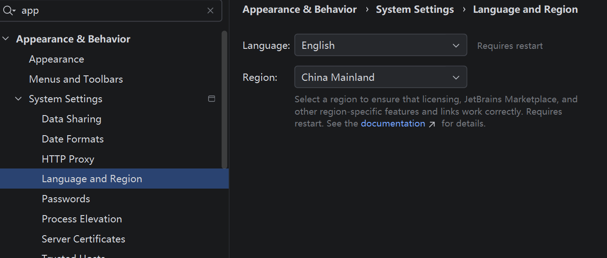
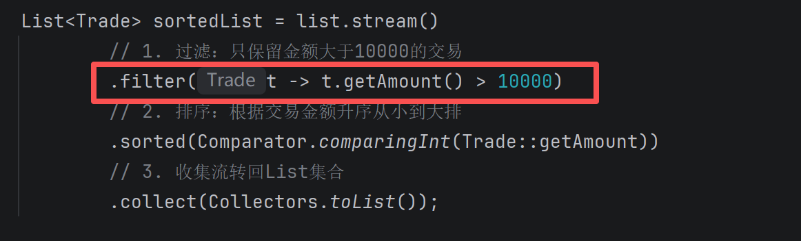
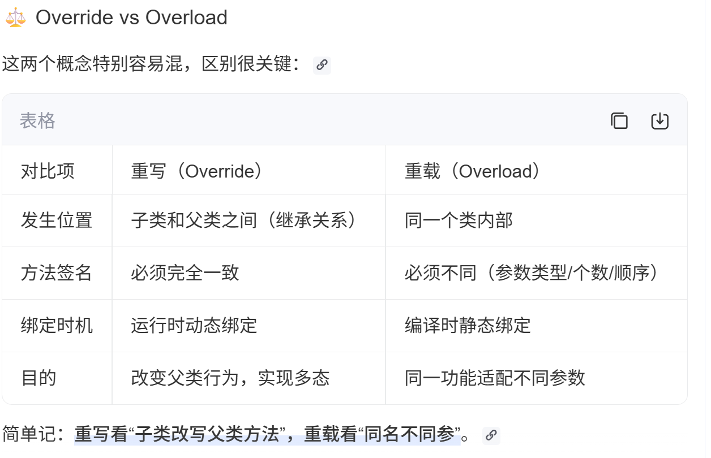
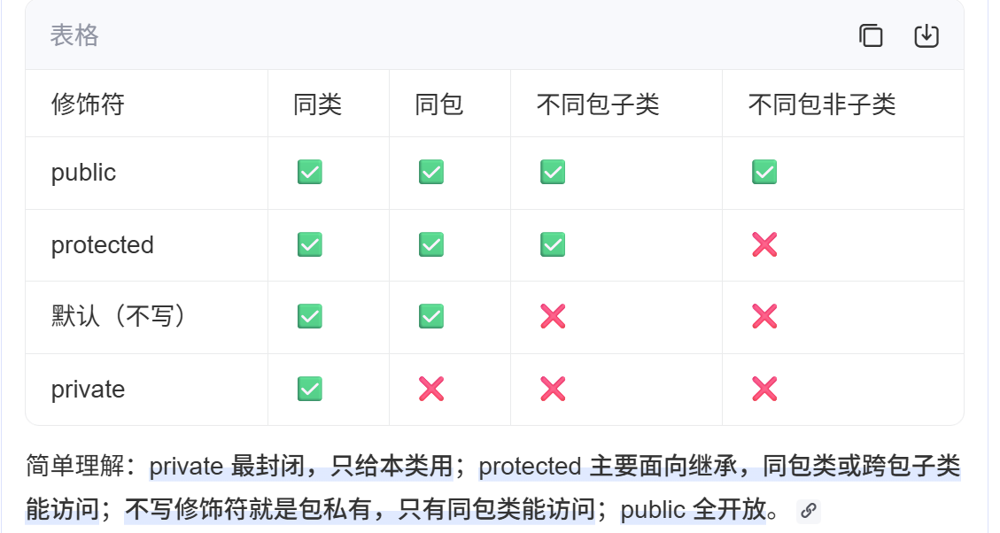
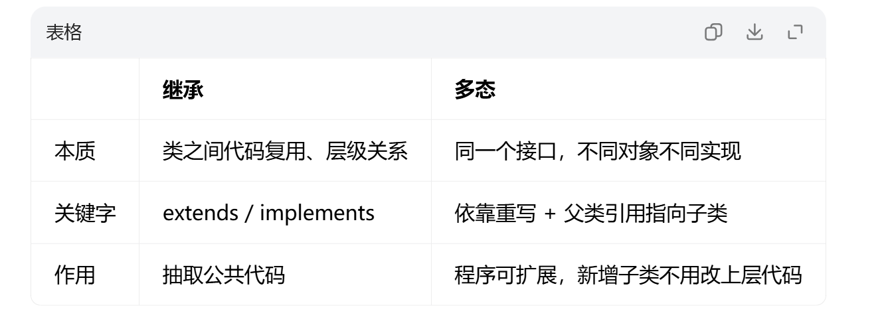
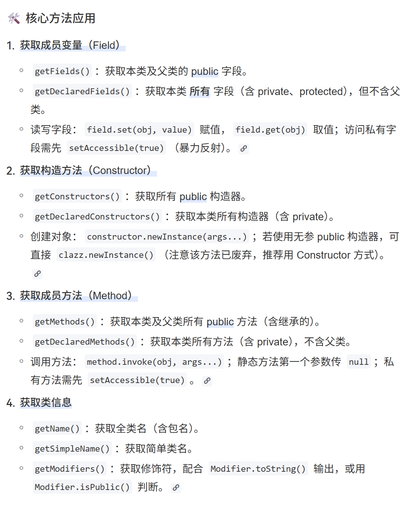
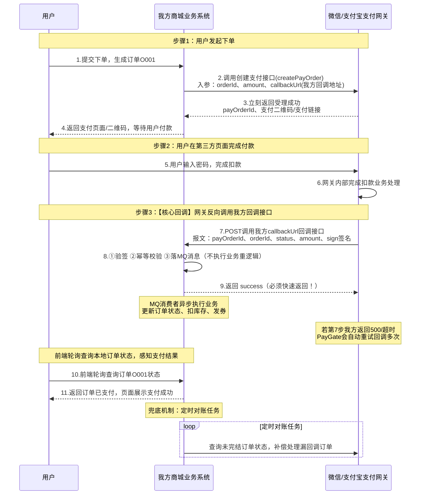
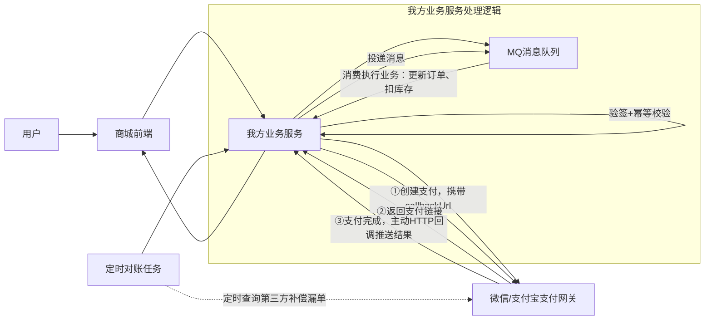
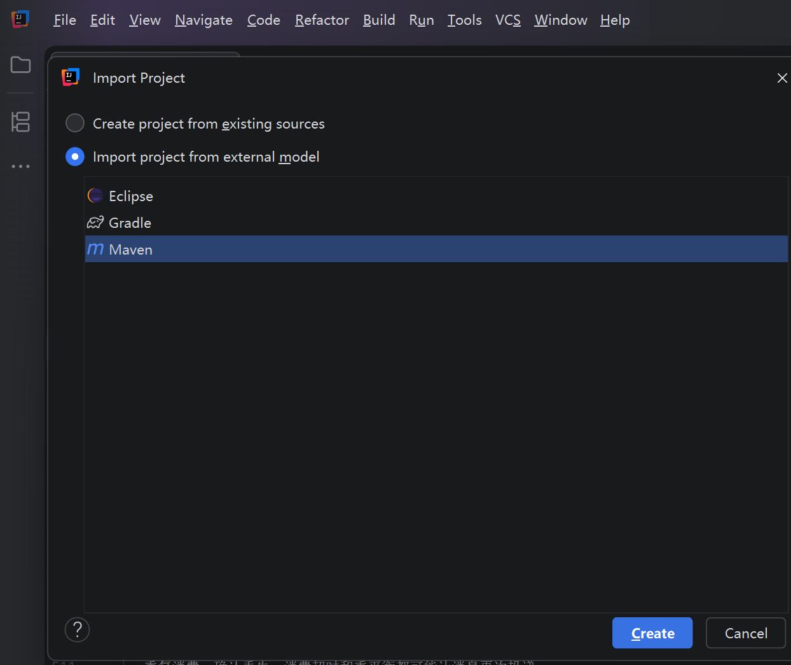

## 前言历史
Java 迭代版本历史演进：https://bbs.huaweicloud.com/blogs/476259

## Java 规范
### 实战项目&面试考题
https://github.com/Snailclimb/JavaGuide
https://interview.javaguide.cn/high-performance/message-queue-interview-questions.html

### 编写和操作规范
1. Java 类名须用大驼峰（PascalCase）且多为名词，方法名须用小驼峰（camelCase）且多以动词开头 
2. 库函数可以用于比较大小： 
3. 运算符:a>b?a:b;
4. desc：从大到小；ASC：从小到大

### 单元测试Junit
- 自动化测试项目必须分离业务 / 测试代码，如：User业务信息和SortTest测试信息
- 创建Junit的测试用例方法；在其他类中选择类名后，右键点击Generate创建Test，即可创建单元测试类
  https://blog.csdn.net/qq_38721302/article/details/115295001
  @Before中的初始化方法名可自定义，通常为 init 或 setUp
- 方法注释模板：https://blog.csdn.net/weixin_43811294/article/details/143840144

## idea快捷键
- 快速创建方法：alt+insert
- 快速创建main方法：psvm
- 快速生成输出语句：souf
- 快速改方法：shift+F6
- 快速格式化代码(代码可观性)：ctrl+alt+L
- for循环的快速调用
  - iter：生成增强型 for 循环（即 for-each），适用于数组或集合遍历。
  - itar：生成基于索引的数组 for 循环（for (int i=0; i<arr.length; i++)）。
  - fori：生成普通 for 循环（需手动补全条件）。
  - itco：生成 Iterator 迭代器循环
  - 其他： 已知String[] strs；如果需要遍历这个字符串数据中的字符串，可以通过strs.for做批量遍历
    ~~~
    生成结果为：
       for (String str : strs) {...}
    ~~~
- 调试方法：
    - Shift+F9：开始调试/重新调试
    - F8 (Step Over)：单步执行，不进入方法内部，适合逐行查看逻辑。
    - F7 (Step Into)：步入方法，进入当前行调用的方法内部，适合追踪自定义函数。
    - Shift+F8 (Step Out)：步出方法，快速执行完当前方法剩余代码并返回调用处。
    - F9 (Resume)：恢复执行，程序会继续运行直到遇到下一个断点。
    - Shift+F10：运行代码
- 选中多行：手动添加多个光标（非连续/任意位置）‌：Ctrl+Alt+Shift+点击 (Win/Linux)
- 查找当前类下的所有方法：ctrl+F12；例如查找公共类：Spring、List下的可用方法；这个方法也可以用在markdown格式下查看目录树信息
- 修改支持语言，ctrl+alt+s进入设置页面，进入外观与行为 | 系统设置 | 语言与区域
- 
- 快速创建指定对象类型（Ctrl+Alt+V）
  - 动态数组列表：在输入new ArrayList<>()后按‌Ctrl+Alt+V，可以在泛型<>中输入包装类信息(如 Integer)
  - String类：输入new String后按Ctrl+Alt+V
- idea查看堆栈结果：菜单工具栏中-code-Analyze Stack Trace or Thread Dump
- 按住两下shift调起快速搜索
- idea下如何使用markdown
https://www.jetbrains.com.cn/help/idea/markdown.html?search=window#code-blocks
- idea下的Find Action:全局搜索命令面板
  - 核心作用就是不用记快捷键，直接按名称搜索并执行 IDEA 里的任何功能或操作
  - 打开方式：双敲 shift 或在 点菜单栏Help → Find Action 打开

## java应用；
### 普通类和枚举类
- 普通类(Class)
    - 作用：允许实例化多个对象 ，需要显式定义构造函数 ，变量值可动态改变
    - idea显示：C图标
  - 枚举类(Enum) 
    - 作用：只能有一个实例(单例模式)，自动包含values()和valueOf()，常用于表示固定的状态集合
    - 典型场景：状态码、选项集合、固定常量值；例如星期一、星期二
    - 说明：枚举类下的每一个枚举项（`LoginPageElement.Username`）是【全局单例对象】，Java 在类加载的时候自动实例化，JVM 会自动帮new，不需要手动 new 实例出来，直接引用常量名就可以拿到实例
    - idea显示：E图标
    - 代码示例
    ```java
    // selenium_factory_demo项目
    // 由单例对象elementEnum可以直接调用接口定义的getBy()方法
    // `LoginPageElement.Username` 枚举常量实例 → 向上转型为 `BasePageElement` 接口引用，赋值给`elementEnum`
    // 注意：接口 A a 只是声明了引用变量，没有指向任何对象，默认为null
     public WebElement getViewElementNotNull(BasePageElement elementEnum){
      By targetBy = elementEnum.getBy();
    }
    ```

### 抽象类、具体类和接口
1. 抽象类
- 定义：类使用了 abstract 关键字修饰
- 场景：自动化框架中，用于抽取「通用状态 + 通用代码」，做纵向继承复用；像是多个页面类，**有大量公共成员 / 公共逻辑，同时又有各自差异化实现**，适合抽成抽象父类
- 区别：抽象类是‌不可实例化、可含未实现方法‌的`基类模板`；具体类是‌可实例化、所有方法均已实现‌的终端类
- 规则：
  1. 单继承，一个类只能 extends 一个抽象类；
  2. 因为有构造方法，供子类 super() 初始化父类成员继续复用，但不能 new  抽象类本身
  3. 不能直接实例化‌，必须由子类继承并实现抽象方法后才能创建对象；可以包含抽象方法‌（只有声明、没有方法体），也可以包含普通的具体方法。
  4. 可以定义：普通成员变量、静态变量、常量；修饰符不限：private/protected/public/static/final 均可
  5. 包含：普通实例方法、抽象方法、static静态方法、私有方法
  6. 在抽象类中使用了@Deprecated注解‌，表示该类或该类中的某个方法已经过时、不推荐使用
  7. 继承关系下，父类定义是 abstract，子类也是 abstract；这种情况下不需要强制实现父类抽象方法，可以按需实现(加上 @Override 注解)，不实现时就往下传递；只有普通非 abstract 子类，才必须实现全部父类抽象方法
  8. 抽象类只是**允许存在抽象方法**，不是要求所有方法都抽象；只要类里存在任意一个 abstract 抽象方法，这个类就必须标记 abstract
  ```
  相关例子见：ViewObjects(abstract)->MappingPage(abstract)->WriteMailPage(已实现的终端类)
  ```
2. 具体类
- 当需定义‌算法骨架‌（模板方法模式）或共享‌有状态逻辑‌时选抽象类；当业务逻辑‌完整确定‌且需生成对象时选具体类 。
3. 接口
- 区别：抽象类侧重“是什么”的层级复用（含状态/部分实现/单继承），接口侧重“能做什么”的行为契约（无状态/全规范/多实现）
- 场景：自动化框架中，支持写信页下的元素信息除了自身，还有弹窗和提醒元素的接口继承，获得更多能力
```java
public class WriteMailPageElement  implements IWebmailDialogElement, IWebmailNotifyElement, IRichEditor 
```
- 规则
  1. jdk8接口新增 default 默认方法：有方法体，实现类可重写可不重写；static 静态方法：只能用接口名调用，实现类继承不到
  2. jdk9接口支持 private 私有方法，供内部default/static复用代码
  3. 多实现，一个类可以 implements 多个接口；接口之间也可多继承 extends 接口1,接口2
  4. 没有构造方法，完全不能实例化，只能常量，无实例变量
  5. 变量默认强制 public static final，必须初始化，不能修改，只能是常量；不能定义普通实例变量
  6. 类在实现接口时，抽象方法必须实现
- 注意点
  1. 抽象类在执行速度更快，因为接口需要额外查找类方法表
  2. 当多个类有大量共用属性和代码 → 抽象类【例如继承关系下，狗是动物】；当只定义行为标准、无关类共享同一功能 → 接口【例如鸟和飞机都会飞】 

### 对象继承原理补充
1. 核心原则
- ‌单继承‌：一个类只能有一个直接父类，但可以实现多个接口，避免C++多继承的“菱形问题”。 
- 根类‌：所有类都隐式继承 java.lang.Object。 
- `构造链`‌：创建子类对象时，会先执行父类构造器，再执行子类构造器。子类构造器第一行默认调用 super()；若父类没有无参构造，必须显式 super(参数)。 
- 访问权限‌：子类可访问父类的 public、protected 成员，不能直接访问 private 成员（但可通过父类提供的 getter/setter 间接访问）。
2. 初始化执行顺序
```
父类静态代码块 → 子类静态代码块 → 父类实例代码块 → 父类构造方法 → 子类实例代码块 → 子类构造方法
```
3. 常见坑
```
父类构造器里别调用会被重写的方法，因为子类字段可能还没初始化。
重写时访问权限收窄（protected 改成 private）会编译报错。
静态方法同名同参属于“隐藏”，不是重写，别期待多态行为。
重写 equals 必须重写 hashCode，否则 HashMap/HashSet 行为异常。
继承层次超过 2-3 层就是坏味道，优先考虑组合 + 接口
```
4. java程序的生命周期(java一次编译，到处运行)
- JDK是java开发的必备工具箱，JDK其中有一部分是JRE，JRE是JAVA运行环境，JVM则是JRE最核心的部分。
- 编译期【 javac 负责把.java源码变成.class字节码】
  - 特点：javac 编译器做语法检查、类型检查、常量折叠，然后生成 .class 字节码文件；不依赖 JVM，不占内存。
  - 常见错误：语法错误、类型不匹配（如 int x = "hello"）。‌
- 运行期【JVM 负责把.class字节码变成机器码并执行结果】
  - 特点：强依赖 JVM，所有动态行为（多态绑定、反射、异常抛出）都发生在这里
  - 常见错误：空指针、数组越界、OutOfMemoryError 等运行时异常。‌


### 关于 List 接口、 ArrayList 类和数组 Array 类
1. 对比
- Array（数组）：数组是固定大小的数据结构，用于存储同一类型的元素。在Java中，数组的大小在创建时就已经确定，并且无法改变。
  - 要注意的是：普通数组‌不可直接“拼接修改”‌（数组长度固定），需通过‌新建数组拷贝‌或转为‌可变集合/字符串构建器‌实现逻辑拼接 
- List（列表）：List是一个接口(关于接口：类通过继承接口的方式，从而来继承接口的抽象方法)，用于表示有序的集合。它定义了许多方法，如add、remove、get等，用于操作列表中的元素。List接口有多个实现类，如ArrayList、LinkedList等。List 接口通过 default 方法定义许多方法，所有实现类（含 ArrayList）自动继承该实例方法，可以直接调用
- ArrayList（动态数组列表）：ArrayList是List接口的一个实现类，它基于动态数组实现。ArrayList具有动态扩展的特性，可以根据需要自动调整大小
~~~
// 可使用 new 关键字创建对象，如new ArrayList<>()
// 定义一个全局成员集合，存储 User 用户对象；
//初始赋值为null，此时只是引用，没有实际 ArrayList 容器
List<User> userList = null;

//创建空的ArrayList容器，分配内存
userList = new ArrayList<>();

//添加对象列表中的数据，注意里面的元素也应该是创建对象
userList.add(new User(1, "小明", 22, "北京"));

// 当要输出动态数组列表时，Java 会自动调用集合内每个User对象的 toString()；
// 前提是原来的User类要重写toString方法,否则会直接使用 Object 父类默认实现,返回哈希值
// 当已重写toString方法时，下述两个执行结果是一样的
System.out.println("原始数据是：" + userList);
System.out.println("原始数据是：" + userList.toString());
~~~
2. 什么是泛型
- 泛型是 Java 的‌类型参数化机制‌，允许在定义类、接口或方法时使用占位符类型（如 \<E>），在实例化时指定具体类型，从而在‌编译期进行类型检查‌、‌消除强制转换‌并提升代码复用性。
- 基本类型不可直接作为泛型参数，必须使用包装类
- 通过泛型，List 和 ArrayList 可以指定集合中的元素类型，确保类型安全。例如，List<Student> 表示存储 Student 类型的对象
  - List 和 ArrayList 都是泛型类型容器。使用泛型可以确保集合中的元素类型是正确的，避免运行时出现编译时的 ClassCastException。
    - 泛型案例
      - Comparator类下的comparing方法
      ~~~
      // 
      public static <T, U> Comparator<T> comparing(
        Function<? super T, ? extends U> keyExtractor,
        Comparator<? super U> keyComparator)
  
      //// 只用comparingInt方法，字符串默认字典升序、数字升序
      单参数写法：userList.sort(Comparator.comparingInt(User::getAge));
      双参数写法：age 为 null 的用户排最前面，有 age 的按年龄升序
      userList.sort(
        Comparator.comparing(
            User::getAge,
            Comparator.nullsFirst(Comparator.naturalOrder())
        )
        ~~~
3. List排序
   1. List原生排序方法，ArrayList自动继承来自List下的可用方法(如sort)；
   ~~~
   List<User> userList = null;
   userList = new ArrayList<>();
   初始化填充数据，调用add方法
   userList.add(new User(1, "小明", 22, "北京"));
   userList.add(new User(2, "小红", 18, "上海"));
   userList.sort(Comparator.comparingInt(User::getAge));
   
    //同上，可以调用asList初始化交易集合，快速生成固定长度 List，存放 4 笔交易
        List<Trade> list = Arrays.asList(
                new Trade(8000), new Trade(15000), new Trade(22000), new Trade(11000)
        );
   ~~~
   2. List转换为Stream排序(Stream方式更简洁，多数据时性能效果更好，高效处理数组和集合)
   -  适用场景：元素批量处理(可以使用filter、map、sorted等方法来处理数据)、并行处理元素、惰性执行的机制，即只有在需要结果时才执行操作  
   - 作用：对集合/数组进行‌过滤、映射、排序、聚合‌等操作，支持‌并行计算‌；简化冗长的for循环，只关注做什么
      ~~~
       // stream方法按id排序，从大到小，把List转为流Stream，可以进行流式操作，最终收集流转为List集合并输出
       List<User> collect = userList.stream().sorted(Comparator.comparing(User::getId).[reversed](Integer::intValue)()).collect(Collectors.toList());
       System.out.println("id按DESC排序从大到小" + collect);
      ~~~
       - 配套stream流下计算函数时，返回基础数值流(OptionalInt)
      ~~~
       1、 sortedList.stream()：把交易集合转为流式操作；
       2、.mapToInt([Trade::getAmount](User::getAge))：取出每个用户的年龄，转为基础 int 流 IntStream；
       3、.min()：计算流中所有 int 数值的最小值；
       4、返回值类型是 OptionalInt，存入变量 minStream；
       5、打印输出这个最小值包装对象。
     // 对象流 → IntStream → 求最值，返回OptionalInt
      OptionalInt minStream = userList.stream().mapToInt(User::getAge).min();
      System.out.println("最小值：" + minStream);
      ~~~
      - 关于mapToInt方法转化后支持高效操作(如min,max,sum,average)
     ~~~
     返回值‌：mapToInt返回一个IntStream，这是专门为原始类型int设计的流。这意味着你可以直接在IntStream上执行针对整数的操作，比如使用sum(), average(), max(), min()等。
     原始类型优势‌：与使用包装类型（如Integer）相比，使用原始类型（如int）可以减少自动装箱和拆箱的开销，从而提高性能。
     链式调用‌：可以在mapToInt后继续链式调用其他流操作，比如filter, sorted, distinct等。
     核心相似方法：mapToLong、mapToDouble、
     
     IntStream ageStream = collect.stream().mapToInt(User::getAge);
        ageStream.forEach(age -> System.out.println("当前每条年龄数据：" + String.valueOf(age)));
           
     注意：如果本身是Integer类型，本身支持自然排序，无需转 int基础流
     ~~~
      - 上述例子中，OptionalInt是基础 int 的空安全包装容器：专门用来区分两种状态：
        ① 流有数据：容器内包裹有效的 int 最小值；
        ② 流为空：容器标记为「空、无数据」，不会直接报错，你可以手动处理空场景。
      - 其他的安全包装容器下的基础数值流：
        - OptionalInt → 搭配 IntStream（mapToInt）
        - OptionalLong → 搭配 LongStream（mapToLong）
        - OptionalDouble → 搭配 DoubleStream（mapToDouble）
      - Integer 包装类不能用==判断值相等，超出缓存区间会判断失效
      ~~~
      // 用equals比较包装类，规避缓存陷阱
       arrayList.get(j).equals(arrayList.get(j + 1))
      不可取： arrayList.get(j) == arrayList.get(j + 1)
      ~~~
    - 关于flatMapToInt方法(流扁平操作，仅做了解)
    ~~~
   // mapToInt: 1 对 1，提取年龄流（人数=年龄数）
    IntStream ages = people.stream().mapToInt(Person::getAge);

    // flatMapToInt: 1 对多，展开每人多个分数为单一整数流
    List<int[]> scoreArrays = people.stream().map(p -> p.getScores()).toList();
    IntStream allScores = scoreArrays.stream().flatMapToInt(arr -> Arrays.stream(arr));

    ~~~
   - 关于转为Stream流后的过滤方法filter
     - 适用在对条件进行筛选，直接传递t对象，相当于一个for循环遍历后获取指定条件过滤
     - 
   - 收集器的区分
     1. Collectors.toList() ---通用写法，要求变量定义为List接口
     ~~~
     无参数，返回 List<T>，底层实现不确定（Java8 为 ArrayList，高版本可变）
      不能强转 ArrayList，无法赋值给 ArrayList<Integer> 变量
       
     示例代码：变量声明改为父接口 List<Integer>，存在父接口的通用能力
     List<Trade> sortedList = list.stream()
              // 1. 过滤：只保留金额大于10000的交易
              .filter(t -> t.getAmount() > 10000)
              // 2. 排序：根据交易金额升序从小到大排
              .sorted(Comparator.comparingInt(Trade::getAmount))
              // 3. 收集流转回List集合
              .collect(Collectors.toList());
     ~~~
     2. Collectors.toCollection(Supplier)--针对数值比较的场景
     ~~~
     接收集合构造方法引用，强制生成你指定的集合（ArrayList/LinkedList 等）
      返回类型和你传入的构造类完全匹配，可直接赋值给 ArrayList<Integer>
     ArrayList<Integer> sortList = new ArrayList<>();
     sortList = arrayList.stream()
     .sorted()
      .collect(Collectors.toCollection(ArrayList::new));
            
     ~~~
4. 数组和集合List的相互转化(https://blog.csdn.net/qq_50900444/article/details/126721639)
    - 集合List转化为数组
    ~~~
   //前提：
   ArrayList<Integer> arrayList = new ArrayList<Integer>();
   
   // 方法1：
   // arrayList通过stream转化成int数字数组格式
   int[] result = arrayList.stream().mapToInt(Integer::intValue).toArray();
    
   // 方法2：直接转化为Integer格式的数组
   Integer[] array=new Integer[arrayList.size()];
    arrayList.toArray(array);
    ~~~
    - 数组转化为集合List
   ~~~
   // 方法1： int或Interger数字数组转动态数组列表(手动转化，这是动态List列表)
   ArrayList<Integer> arrayList = new ArrayList<Integer>();
        for (int num : nums) {
            arrayList.add(num);
        }
    // 方法2：Integer数字数组转动态数组列表(通过Arrays工具类中的已知方法asList()转化，asList 陷阱‌：Arrays.asList() 返回的是固定长度列表，不支持add/remove操作)
   Integer[] array = new Integer[] {3,4,5,6,23,8};
    List<Integer> list = Arrays.asList(array);
    注：如果需要变成动态List:new ArrayList<>(...)：
   List<Integer> list = new ArrayList<>(Arrays.asList(array));
   // 方法3：int数字数组的流式转换
   int[] array= {1,2,3};
   List<Integer> list=Arrays.stream(array).boxed().collect(Collectors.toList());
 
      ~~~
5. 针对不同场景的求最值情况
    - 针对有对象的情况，从大到小排序后获取最大和最小值：
    ~~~
   方法1：转流中排序后转集合
    List<User> collect = userList.stream().sorted(Comparator.comparing(User::getId).reversed()).collect(Collectors.toList());
    int min = collect.get(collect.size() - 1).getAge();
    int max = collect.get(0).getAge();
    int sum = 0;
    for (User c : collect) {
    sum += c.getAge();
    }
    
    方法2：对象流转IntStream后求最值
    // 对象流 → IntStream → 求最值，返回OptionalInt
    OptionalInt minStream = userList.stream().mapToInt(User::getAge).min();
    
    方法3：调用sort来排序
    userList.sort(Comparator.comparing(User::getAge));
    userList.sort(Comparator.comparing(User::getId).reversed());
    ~~~
    - 针对数值比较
    ~~~
   int a1=2,b1=33,c1=4;
    ArrayList<Integer> list = new ArrayList<>();
    list.add(a1);
    list.add(b1);
    list.add(c1);
    方法1：直接调list.sort方法排序
    list.sort(Integer::compareTo); //从小到大的升序排序
    list.sort(Comparator.reverseOrder()); //从小到大的降序排序
    
    方法2：调用stream来求最值
    ArrayList<Integer> descList = list.stream()
    .sorted(Comparator.reverseOrder())
    .collect(Collectors.toCollection(ArrayList::new));
    ~~~

### ArrayList 和 LinkedList 的区别和联系
- 联系：
  1. 接口关系：均实现 List 接口，支持有序、可重复、允许 null 值存储，且默认‌非线程安全‌。
  2. 继承关系：均继承自 AbstractList（LinkedList 实际继承 AbstractSequentialList），属于 Java 集合框架的核心列表实现
- ArrayList
  1. 底层数据结构‌：ArrayList 是‌连续内存的动态 Object 数组
  2. 随机访问技能：ArrayList 实现 RandomAccess 接口，get(index) 为O(1)‌；
  3. 适用场景：读多写少、频繁按索引查询、数据量稳定或尾部操作为主、对内存敏感及需良好缓存局部性的场景。
  4. 内存占用与缓存‌：ArrayList 仅存数据，可能有扩容预留空间但‌CPU 缓存友好
- LinkedList[UI自愈手段&具体实现逻辑(Anita).md](../autotest_project/XT6_autotest/UI%E8%87%AA%E6%84%88%E6%89%8B%E6%AE%B5%26%E5%85%B7%E4%BD%93%E5%AE%9E%E7%8E%B0%E9%80%BB%E8%BE%91%28Anita%29.md)
  1. 底层数据结构：LinkedList 是‌离散内存的双向链表节点‌（每个节点含前驱、后继指针及数据）。
  2. 随机访问技能：LinkedList 无索引机制，需从头/尾遍历，get(index) 为 O(n)。
  3. 适用场景：写多读少、频繁在‌头尾‌进行入队/出队或栈操作、无需随机访问且能接受较高内存开销的场景；若需中间频繁增删，需先确认已持有节点引用否则性能未必优于 ArrayList。
  4. 内存占用与缓存‌：LinkedList 每个节点额外消耗 2 个指针及对象头开销，‌内存占用通常为同量级 ArrayList 的 4-5 倍‌且缓存命中率低 。
  5. 相关案例：处理数据流、任务调度器(https://cloud.tencent.com/developer/article/2556085)
  
### Integer 包装类 和 int 基本类型 的区别
- 基础 int：存数值，默认是 0 不能空，循环计算性能强；
  - 应用场景：追求运算速度、确定非空优先 int；允许为空、存集合用 Integer
- 包装 Integer：
  - 包装类存对象，属于引用类型，继承 Object，堆中创建对象，可调用方法、可存 null(适合表示缺失数据)。比较要用 equals
  - 应用场景：集合框架（List<Integer>、Map）、泛型定义、数据库映射（需区分 NULL 与 0）、JSON 序列化（需保留 null 语义）、作为对象传递
  - 转化时：基础数组 int [] 转 List 必须 boxed ()，不能直接 asList
  - ‌空指针风险‌：包装类为 null 时拆箱会抛 NullPointerException，比如 Integer a = null; int b = a; 直接报错
- 其他包装类(Integer、Long、Float、Double)：
  - 可以直接使用这些类的.compareTo()方法或者使用比较操作符（在使用.compareTo()方法可以处理Null值的情况）
  - 

### Arrays和 Array 类的区别
- Array 负责‌运行时动态生成数组、读写元素‌（依赖 JNI/反射机制）
  - 应用场景：java.lang.reflect用于‌反射动态创建/访问数组‌的不可实例化类
- Arrays 负责‌对已存在数组进行算法操作‌（排序、查找、拷贝、比较、转字符串等）
  - 应用场景：java.util包中提供‌排序、搜索、填充等静态工具方法‌的数组操作类 
  - 使用频率：日常业务开发几乎只用‌Arrays‌；‌Array‌仅出现在框架底层、序列化、泛型擦除处理等反射场景
  - 高频方法：
  ~~~
    快速排序/二分查找：Arrays.sort(arr), Arrays.binarySearch(sortedArr, key)。
    数组内容对比与打印：Arrays.equals(a1, a2), Arrays.toString(arr)（调试必备）。
    批量赋值与拷贝：Arrays.fill(arr, val), Arrays.copyOf(arr, newLen)。
    临时转为固定大小 List：Arrays.asList(arr)（注意不可增删元素）。
  ~~~

### 关于 String 类和 StringBuilder 类
1. 对比
- 用 String‌：字符串内容确定不变、需作为哈希键、多线程只读共享场景。
- 用 StringBuilder‌：单线程环境下大量字符串拼接、修改（如循环内组装）
2. StringBuilder 类
- StringBuilder 类提供了许多方法来操作字符串，包括插入、删除、替换和提取子字符串等。
- StringBuilder 没有直接的方法像 String 类的 substring(int beginIndex, int endIndex) 那样来提取子字符串，但可以通过调用 toString() 方法将 StringBuilder 对象转换为 String 对象，
再使用 String 的 substring 方法
- 支持创建对象时传递参数
- 存在不同方法：
~~~
append() 方法可以用来添加不同类型的参数到 StringBuilder 对象中。
insert() 方法允许你在指定位置插入一个字符串或字符序列。
replace() 方法用于替换字符串中的一部分。
setCharAt() 方法用于设置指定位置的字符。
reverse() 方法用于反转字符串中的字符顺序。


代码示例：
int a = 123;
 String revA = new StringBuilder(String.valueOf(a)).reverse().toString();
~~~
3. 注意
- 字符串不是数组，如果需要获取单一的字符，可以用对象获取方法：str.charAt(int index) 是 Java 中用于‌返回指定索引位置字符‌的方法
- 关于字符类Character，存在将字符转化的方法
~~~
StringBuilder sb = new StringBuilder();

// 赋值如下，提取返回给c
char c = str.charAt(i);

// 字符转化的方法，并返回结果在StringBuilder容器中动态写入
sb.append(Character.toUpperCase(c));
~~~

~~~
 String str = "This is a sample an other test";
 
 char c = s.charAt(i);
            if (c >= 'a' && c <= 'z')
                tempStr += Character.toUpperCase(c);
  String newstr = "";
  newstr = newsb.toString();
~~~

#### 使用误区
~~~
StringBuilder sb = new StringBuilder();
String new_str = "";
new_str = sb.toString().toLowerCase() 不会修改 sb 里的原始字符：
分析如下：
sb.toString()：生成一个全新 String 副本，和 StringBuilder 无关联
.toLowerCase()：又生成第二个全新小写字符串，仅赋值给临时变量 new_str
StringBuilder sb 是可变容器，全程只 append 原始字符，内部数据永远是最开始 append 进去的大小写
~~~

### 关于Java设计模式
1. 接口静态工厂方法
   - 接口是设计来定义一组方法但不提供实现细节的
   - 接口静态方法可以在实现该接口的类中直接使用，或者在接口本身内部使用
~~~
// Comparator就是一个接口
// 调用接口静态方法，传入年龄取值方法引用，自动生成一个 Comparator<User> 比较器对象；
// 把生成好的比较器传入 userList.sort() 方法，作为排序规则
userList.sort(Comparator.comparingInt(User::getAge));

补充：
// comparing(Function keyExtractor)：通用版，接收包装类型（Integer/Long/String 等），返回 Comparator<T>；底层会自动装箱、拆箱，存在少量包装类开销。
// comparingInt(ToIntFunction keyExtractor)：专用基础 int 版本，接收原始基本类型 int，返回 Comparator<T>；全程无装箱拆箱，性能更好，专门针对 int 字段（age、id、金额）

// 使用 Compator 方法按照单字段id做从大到小排序，reversed是做次序反转
userList.sort(Comparator.comparing(User::getId).reversed());
~~~


### 哈希表
- 原理：
哈希表（Hash Table）是一种使用哈希函数组织数据，以支持快速插入、删除和查找操作的数据结构。哈希表通常使用数组来实现，并结合哈希函数来计算元素的存储位置。
  - 设计思路
    HashMap 的设计思路: 用数组保证快速寻址,用链表解决哈希冲突,用红黑树兜底极端情况,用 2 倍扩容配合位运算保证效率。【相关应用见：MappingPage封装对元素标识和元素信息(定位器)的映射】
    ```
     protected Map<Object, String> keyMap = new HashMap<Object, String>();
     this.keyMap.put(WriteMailPageElement.WriteMailTab, "xpath#//div[@class='mltabview-panel'][contains(@data-panel, 'compose')]");
    ```
- LinkedHashMap: 仅做示例，待后续补充
```java
// HashMap和LinkedHashMap
protected Map<Object, String> keyMap = new HashMap<Object, String>();
Map<String, int[]> counter = new LinkedHashMap<>();
```

### 关于json、jsonNode、jsonObject类
1. json 是一个字符串，字符串没办法取值。
2. jsonNode 是一个对象，jsonNode中都是键值对形式，可以根据Key取出对应的值！
要想获得某个值，可以将json转化为jsonNode，然后再取出想取的值。JsonNode提供了更灵活和强大的方式来处理复杂的JSON数据，包括数组和嵌套对象。它支持遍历、查询和修改JSON数据。
3. jsonObject 是一个json对象，jsonObject也可以根据key获得对应的值。json字符串可以转换为jsonObject。jsonObject也可以转换为对应的实体类对象。jsonObject使用{}来表示
适用于简单的JSON操作，如读取、修改和生成JSON字符串。
~~~
如果需要简单的JSON操作，如快速创建和解析JSON字符串‌，使用org.json.JSONObject可能更方便。
‌如果需要处理复杂的JSON结构，如数组、嵌套对象以及需要更灵活的数据访问方式‌，使用com.fasterxml.jackson.databind.JsonNode会更好。Jackson库在处理大型JSON数据和性能方面通常更优。
~~~


### java中的静态方法、实例方法、构造方法
- ‌静态方法‌：用 static 修饰，属于类本身，通过 类名.方法名() 直接调用，无需创建对象。它‌只能访问静态成员‌，不能直接访问实例变量或调用实例方法。[适合工具类、辅助函数、工厂方法]
- ‌实例方法‌：属于具体对象，必须 new 出对象后才能调用。它‌可以访问实例成员和静态成员‌，是操作对象状态的主力。[适合需要操作对象属性的场景]
- ‌构造方法‌：方法名与类名相同、没有返回值类型，在 new 对象时自动执行，用来完成对象的初始化，不能被手动调用。[用于对象创建时的参数赋值、资源初始化]
~~~
在jdk8+的版本上
实例方法的应用：
String类下 实例方法（必须创建对象后调用，不能 String.xxx ()）
split()、substring()、charAt()、length()、toUpperCase()、trim()、equals()

静态方法的应用
1、String类下 静态方法（可以直接 String.xxx ()）即：类名.方法名()
String.valueOf (任意类型)
String.format()
2、接口内 static 方法：只能是接口名.方法名()；接口的实现类 / 子类不能调用也不会继承这个方法，所以接口的方法是不会向下传递的
~~~

### 方法重写(@Override)和方法重载(@Overload)
- Override(重写)：子类改写父类方法，实现多态，编译期看声明类型，运行期按对象实际类型调用方法，就可以动态获取子类实现的方法
  - 和父类的方法签名必须一致‌
  - 和父类返回值类型兼容‌
  - 访问权限不能缩小‌：子类方法的权限必须大于等于父类。比如父类是 protected，子类可以是 protected 或 public，但不能是 private 或包默认权限
  - 异常声明不能扩大
  - 关于@Override注解要加上，便于编译器检查和代码维护
  - 补充知识点：
    1. super 关键字‌：重写后想保留父类逻辑，用 super.方法名() 调用父类版本，再扩展自己的逻辑。
    2. 接口方法‌：类实现接口时，抽象方法必须实现；default 方法可以选择重写或直接用默认实现；static 和 private 方法不能重写。
    3. 常见误区‌：父类返回 Object，子类返回 String 是合法的（String 是 Object 的子类）；但反过来不行，那叫逆变，不被允许。‌‌
- Overload(重载)：同一功能适配不同参数


### Java中public、private、protected及默认访问修饰符的区别【针对在类、字段、方法、构造器】
- 建议：日常建议遵循‌最小权限原则‌：成员变量用 private，对外方法用 public，需要子类扩展的用 protected
- private(封装的核心):只有类不能被声明为private，其他只能在声明它的类内部访问‌，典型用法是‌成员变量私有化‌，再通过 public 的 getter/setter 暴露访问，这样能在 setter 里加校验，保护数据安全
- protected(继承体系专用)：只有类不能声明为protected,跨包子类访问 protected 成员时，‌不能通过父类实例直接调用‌，得通过子类自身或 super 来访问;适用在父类里希望子类继承或重写的模板方法、字段。‌
- public修饰符:最宽松，表示任何类都可以访问被修饰的类或类成员。无论这个类位于哪个包中，public成员始终对所有其他类可见
- 

### java中的关键字(如super、this、abstract。。。)
- super：
  - Java 里用来访问‌父类成员‌的关键字，核心就三种用法：调用父类构造方法super(参数)、访问父类属性super.变量名、调用父类被重写的方法super.方法名()；常用在子类重写时复用父类的逻辑
  - 构造方法里没写 super() 也没写 this() 时，默认就是 super()，所以父类最好保证有无参构造
  - 详情见下述【java 对象类的执行顺序】ViewObjects->MappingPage->WriteMailPage的继承调用
- this：指向当前对象。this.属性 区分局部变量和成员变量，this() 调本类其他构造方法（也必须在第一行）
- static‌：修饰的成员属于类而不是对象，所有实例共享一份
```java
// 结合代码可以确定，元素标识变成属于【类本身】的常量，无需new 这个类，直接用类名。变量名读取
// JVM 加载`WriteMailPageElement`类的时候，静态变量在方法区分配内存，只初始化 1 次
// 元素定位的 key 是**页面固定不变的元数据**
public class WriteMailPageElement implements IWebmailDialogElement, IWebmailNotifyElement, IRichEditor {
    public static String WriteMailTab = "WriteMailTab";

// AI建议，加上final变成常量不可变化
//推荐写法，常量不可变
public static final String WriteMailTab = "WriteMailTab";
  
// 结合WriteMailPage
 this.keyMap.put(WriteMailPageElement.Closetooltip, "xpath#//div[@class='introjs-tooltip']/div[@class='introjs-tooltipbuttons']/a[@class='introjs-button introjs-skipbutton']");

// 不加static时
public String WriteMailTab = "WriteMailTab";
// 后续需WriteMailPageElement element = new WriteMailPageElement(); 根据对象去取值element.WriteMailTab
```
- abstract‌：修饰类是抽象类（不能实例化），修饰方法是抽象方法（只有声明没有实现，必须在子类中重写）。
- extends / implements‌：extends 用于继承一个类，implements 用于实现一个或多个接口
- final：用于限制类、方法或变量被修改；它主要用来保障代码的安全性和稳定性

### 继承和多态【具体示例见：cm自动化框架体系说明readme(Anita).md 【Base层PO页面对象逻辑封装】】
- 继承:继承是类与类之间的 is-a 关系;关键字：`extends` 一个类只能直接继承一个父类，但可以多层继承
- 多态：同一个行为，不同对象有不同实现；编译看左边，运行看右边。
  多态前提（缺一不可）：
  1. 存在继承 / 实现关系
  2. 子类重写父类方法
  3. 父类引用指向子类对象：`父类 引用 = new 子类();`
  > 编译阶段：看引用类型（左边）；运行阶段：执行对象真实类型（右边）的重写方法。



### java 对象类的执行顺序
- 创建对象时，构造方法最后执行；重写方法和自定义方法不会在对象初始化阶段自动执行，只有被显式调用时才会运行。‌
- 具体顺序是这样的：
```aiignore
初始化阶段只关心“静态 → 实例 → 构造”
先执行静态内容‌：静态变量赋值和静态代码块（类加载时执行一次）。
‌再执行实例内容‌：实例变量赋值和实例代码块（每次创建对象都会执行）。
‌最后执行构造方法体‌：实例内容全部完成后，才进入构造方法。
至于‌重写方法和自定义方法‌，它们不是初始化流程的一部分，不会自动触发。只有两种情况会被调用：①代码里手动调用 ②父类构造方法‌里调用了被子类重写的方法，如下
```
- 注意：‌如果构造方法里调用了某个方法，这时会执行它。但有一个坑【不是编译报错，很难排查】——如果在‌父类构造方法‌里调用了被子类重写的方法，由于多态机制，实际执行的是子类重写版本，而此时子类字段还没初始化，读到的是默认值（如 null、0）。
- 详情可见：cm自动化框架体系说明readme(Anita).md的PO页面的模板方法设计模式
- 多态生效原则：编译期看声明类型(MappingPage)，运行期按对象实际类型调用方法(WritePage),执行WritePage下重写的initKeyMap()
- 结果：新建好的`WriteMailPage`实例，赋值给父类类型引用`MappingPage page`
- 链路形式
```
1. **编译期**：编译器看引用类型 `MappingPage`，检查 MappingPage 是否存在 initKeyMap () 抽象方法 → 存在，编译通过
2. **运行期**：JVM 找到`page`指向的真实对象`WriteMailPage`，执行**子类重写后的 initKeyMap**
3. 执行完子类 initKeyMap，return 返回，回到用例代码
```
```java
// `ViewObjects`：父类，构造接收`ViewDriver`，持有成员`viewDriver`
public ViewObjects(ViewDriver viewDriver){
    this.viewDriver = viewDriver;
}

// `MappingPage extends ViewObjects`：子类，构造调用`super(viewDriver)`，并且执行`initKeyMap()`做字段映射初始化
public MappingPage(ViewDriver viewDriver){
    super(viewDriver);
    initKeyMap();
}
protected abstract void initKeyMap();

// 把`initKeyMap()`移出父类构造，子类WriteMailPage在构造时需手动调用
public WriteMailPage(ViewDriver viewDriver) {
    super(viewDriver);
}

// 子类WriteMailPage下的方法
@Override
protected void initKeyMap() {
    keyMap.putAll(IWebmailDialogElement.xm);
    ...
}


```
### Java注解和反射(序列化和反序列化)
- 1. 通过反射获取到已知类的方法、属性和构造器
     https://cloud.tencent.com/developer/article/1995663
- 2. Java反射的核心入口就是 Class 类，拿到它之后才能继续操作字段、方法和构造器；用 Class.forName() 加载类，再通过 Constructor 创建实例，实现解耦和扩展
- 3. 利用 Java 反射机制实现“配置驱动的对象创建”‌，即通过传入 Class 对象动态实例化具体的视图类，而不是在代码中硬编码 new 关键字
  - getDeclaredConstructor(ViewDriver.class):
    1. 使用 getDeclaredConstructor 获取本类所有构造器（含 private）
    2. ‌参数匹配‌:明确指定需要找一个接收 ViewDriver 类型参数的构造器。这是解决重载构造器歧性的关键。
    3. newInstance(viewDriver): 调用该构造器，传入 viewDriver 实例，从而创建出对应的视图对象。
```java
XT5ViewPageFactory:
public ViewObjects getPage(XT5ViewPages page) {
        try {
            Object o = page.v.getDeclaredConstructor(ViewDriver.class).newInstance(viewDriver);
            有这么语句是这么设计的；已知关联的public final Class v;
          ...
        }
  XT5ViewPages:
          XT5ViewPages(Class v) {
        this.v = v;}
```

- 4. 序列化和反序列化相关：[UI自愈手段&具体实现逻辑(Anita).md](../autotest_project/XT6_autotest/UI%E8%87%AA%E6%84%88%E6%89%8B%E6%AE%B5%26%E5%85%B7%E4%BD%93%E5%AE%9E%E7%8E%B0%E9%80%BB%E8%BE%91%28Anita%29.md)
 
  - WebDriver 协议通信：Selenium 自动化能跑起来，靠的是你的代码 → WebDriver 驱动 → 浏览器这条链路，而每一环的数据传递都在做序列化和反序列化。‌
    1. 客户端序列化‌：当你调用 driver.findElement(By.id("submit")) 时，Java 客户端库会把这个“查找元素”的指令，按 WebDriver 协议封装成一个 JSON 对象‌（比如 {"using": "css selector", "value": "#submit"}），然后通过 HTTP POST 请求发给浏览器驱动。
    2. ‌服务端反序列化与再序列化‌：浏览器驱动（如 chromedriver）收到这个 JSON 请求后，‌反序列化‌解析出具体指令，再转成浏览器能懂的原生命令执行。
    3. ‌结果回传‌：浏览器执行完（比如找到了元素或返回属性值），结果又会被‌序列化‌成 JSON 响应，传回给你的 Java 代码，代码再‌反序列化‌成 WebElement 对象或属性值，供你断言使用。‌
  > 这一层是 Selenium 框架自己完成的，你写代码时通常感知不到，但理解了它，就能明白为什么 Selenium 比 Playwright 更“重”——每一步通信都有序列化、反序列化和网络延迟的开销


### java中的Lambda表达式
ExpectedConditions类的用法和了解差异
```java
/// 这个是 selenium3 的语法 
Wait ().until (ExpectedConditions.visibilityOf (element));
// 这个是 selenium4 的语法 
wait.until (d -> element.isDisplayed ());
```

## 接口设计
### 同步、异步、回调机制
1. 具体见：
> 接口测试下的同步、异步、异步回调关注点.md
> https://blog.csdn.net/JN_Fahrenheit/article/details/164087729?sharetype=blogdetail&sharerId=164087729&sharerefer=PC&sharesource=JN_Fahrenheit&spm=1011.2480.3001.8118
2. 实际案例：涉及召回邮件前后的逻辑，类似于升级，点击召回前状态检查->召回后状态检查(正在召回)->召回结果的状态检查，涉及流转图的判断验证
### 架构设计
### 高性能系统
1. mysql主从复制---详细见：E:\A-面试相关\03-个人总结\常见问题
2. nginx负载均衡---详细见：E:\A-面试相关\03-个人总结\常见问题
3. 高可用---https://interview.javaguide.cn/high-availability/high-availability-system-interview-questions.html#%E5%93%AA%E4%BA%9B%E6%83%85%E5%86%B5%E4%BC%9A%E5%AF%BC%E8%87%B4%E7%B3%BB%E7%BB%9F%E4%B8%8D%E5%8F%AF%E7%94%A8
#### 消息队列
- 测试方法：
- 链路思路：商城业务系统把消息发送给Broker消息代理(消息队列MQ)，Broker(消息代理)负责存储和投递，消费者从 Broker 获取消息并完成业务处理。
1. 异步处理时，需要用到如下流程图和架构图，由MQ消息队列来存储


2. 引入 MQ 后，系统会增加下面这些问题：
- 可用性依赖：MQ 故障可能阻塞生产或消费链路。 
- 消息可靠性：生产、存储和消费阶段都可能丢失消息。 
- 重复消费：确认丢失、消费超时和重平衡都可能让消息再次投递。 
- 顺序变化：多分区、多消费者和重试会影响消息顺序。 
- 消息积压：消费者处理能力低于生产速度时，延迟会持续扩大。 
- 数据一致性：异步链路通常只能提供最终一致，需要对账和补偿。 
- 排查难度：问题定位需要同时检查生产者、Broker、消费者、业务日志和 Trace。
3. 类比邮箱系统的da消息队列设计
- 背景：
  - 1. 邮件系统中的队列管理是其核心组成部分。邮件在发送时，会被存储在不同类型的队列中进行调度；常见的队列例如有入站队列、延迟defer队列、退信bounce队列；
  - 2. web端经wmsvr前端服务调用发信结果触发底层mtasvr的发信服务处理，转da邮件队列存储
- 问题现象：发信时存在异常报错，提示FS_MTA_N11
- 解决方向：
    - a. 获取客户环境和版本信息用于复现问题后未能重现
    - b. 引导客户在web端复现后，获取日志分析发现前端处理wmsvr日志存在耗时超过10s， 
    - c. 通过sid提取mta和da日志发现收信人较多且多为邮件列表下的用户，存有耗时，邮件进入延迟投递队列defer，初步确认原因是：当mtasvr检查邮件列表用户时，由于列表用户太多，读取展开邮件列表，导致检查时间过长
    - d. 通过命令iostat -d -x -k 1 10定位后发现如下磁盘IO有await的等待(说明IO请求在队列中等待的时间过长)，且%util过高，且且w_await远高于r_await，可知磁盘IO存在磁盘瓶颈过高导致mta获取邮件列表用户后仍发信有报错(存在磁盘写入造成的繁忙问题)；无法通过释放磁盘空间的方式来保证磁盘IO
- 根因：因磁盘无法调整，上游 wmsvr 调用 mtasvr 发信，原有超时时间设置太短，下游da队列处理的邮件还没处理完，上游wmsvr直接判定超时抛出报错
- 解决方案：因为客户磁盘无法调整，只能通过调整上游线程在连接mtasvr时的等待时间为2min；定期检查磁盘I/O观测

## 远程github获取包
1、复刻fork合适的github源码在本地后，在PC端上clone
```aiignore
去除代理限制后：git config --unset http.proxy
git clone https://github.com/JN-Fahrenheit/appium-cucumber-junit5-mobile-automation-framework.git
```
2、导入项目

3、发现导入后README.md不可编辑时，直接通过退出 IDEA，重新打开这个项目

## SpringBoot的分层结构
Spring 应用通常采用三层架构：Controller（控制层）→ Service（业务层）→ Repository/Mapper（持久层）。‌
- Controller‌：接收 HTTP 请求，调用 Service，返回响应。只做协议转换，不写业务逻辑。
- Service‌：处理核心业务规则（如参数校验、事务管理、权限检查），再调用持久层执行 CRUD。它不会直接操作数据库，而是通过 Repository/Mapper 完成返回给Cotroller。
- DAO(Repository/Mapper)：直接与数据库交互，执行 SQL 或 ORM 映射。这一层才真正实现 CRUD 的底层操作。‌
  > 标准请求流程：客户端请求 → Controller → Service → DAO → 数据库，响应则按相反方向返回。‌

# 着重待办
## 关于rest-assured框架
https://home.openweathermap.org/
注册账号：786637288@qq.com 13612353575
jsonpath熟悉：https://github.com/json-path/JsonPath
weather的API接口
https://openweathermap.org/api/current?collection=current_forecast


## BDD三段式
- given：设置测试预设，包括请求头、请求参数、请求体、cookie等
- when：所要执行的操作，即发起请求的网址（GET / POST 请求）
- then：响应结果的解析、断言


## 获取api响应：
1. extract().response() 将响应结果赋值到一个 Response 类型的变量中。
2. Gpath的使用：Gpath用来提取响应中的某一个具体的数据。
- 提取JSON：res.jsonPath().get(“XXX.XXX.XXX”);
- 提取xml：res.xmlPath().get(“XXX.XXX.XXX”);
- 提取HTML：res.htmlPath().get(“XXX.XXX.XXX”);

领域驱动设计DDD
这个设计思路在selenium框架中也有提及
https://en.wikipedia.org/wiki/Domain-driven_design

## 参考资料
- [RestAssured 官方入门](https://github.com/rest-assured/rest-assured/wiki/GettingStarted)
- [原中文参考](https://github.com/RookieTester/rest-assured-doc/blob/master/2016-12-12-%E3%80%90%E6%8E%A5%E5%8F%A3%E6%B5%8B%E8%AF%95%E3%80%91rest-assured%E7%94%A8%E6%88%B7%E6%89%8B%E5%86%8C%E4%B8%AD%E6%96%87%E7%89%88.markdown)