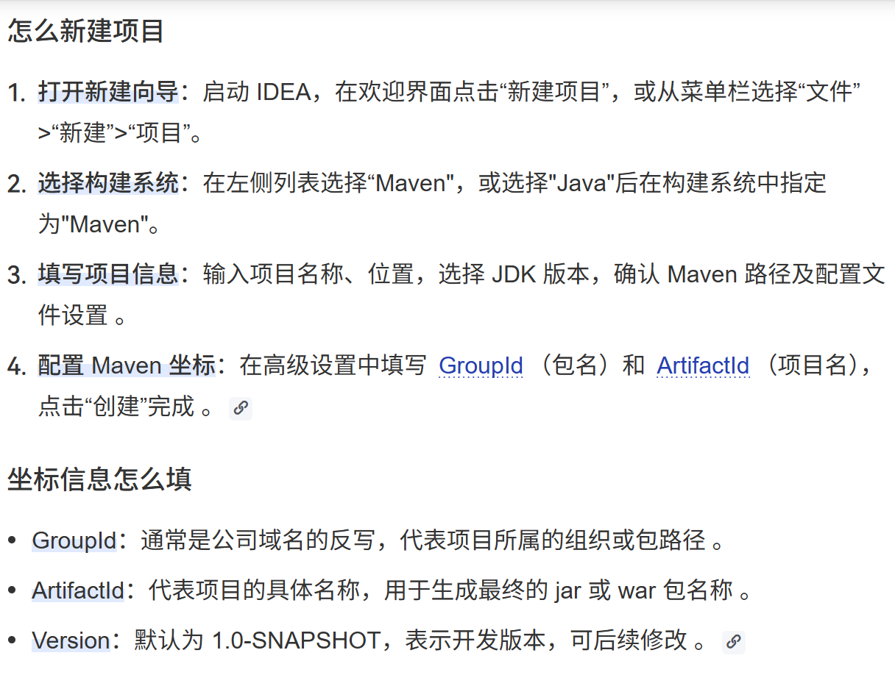
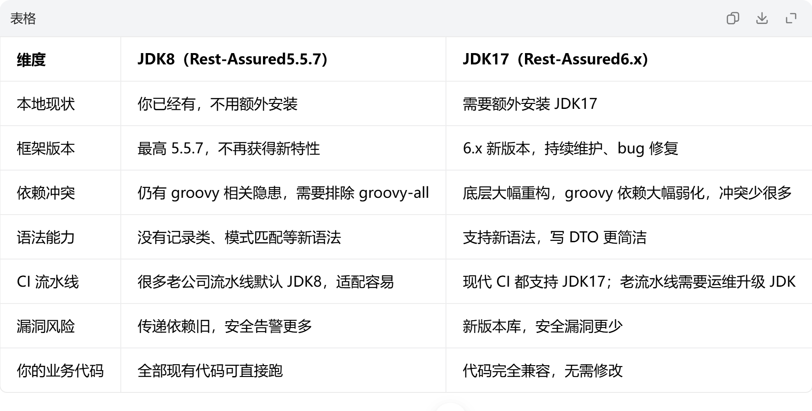

## IDEA 快速搭建 Rest‑Assured 独立接口自动化框架
1. 新建java下的maven项目

2. 修改原pom.xml
```aiignore
<?xml version="1.0" encoding="UTF-8"?>
<project xmlns="http://maven.apache.org/POM/4.0.0"
         xmlns:xsi="http://www.w3.org/2001/XMLSchema-instance"
         xsi:schemaLocation="http://maven.apache.org/POM/4.0.0 http://maven.apache.org/xsd/maven-4.0.0.xsd">
    <modelVersion>4.0.0</modelVersion>

    <groupId>cm</groupId>
    <artifactId>api_autotest</artifactId>
    <version>1.0-SNAPSHOT</version>

    <properties>
        <maven.compiler.source>8</maven.compiler.source>
        <maven.compiler.target>8</maven.compiler.target>
        <project.build.sourceEncoding>UTF-8</project.build.sourceEncoding>
    </properties>

</project>
```
3. 建议java版本选型jdk17，当前选型使用jdk8，具体见pom.xml


### 迁移postman接口
- 项目路径：E:\IdeaProject\api_autotest
- Postman 复制登录请求 Body JSON →  可以下载 IDEA 使用插件自动生成 POJO(插件名称为pojo to json),二次确认又安装了GsonFormatPlus不可行，安装插件json2java，参考插件中的使用方法，完成转化
- 当前进度2026.08.29
- 1. 骨架框架未搭建，要深入理解下：Rest‑Assured 企业级接口自动化框架设计（IDEA + Maven，基于你已有 Postman 调试好的登录接口）
```aiignore
api‑auto‑test （独立maven项目）
├── pom.xml
└── src
    └── test
        ├── java
        │   └── com.xxx.api
        │       ├── base                # 基础层【核心】
        │       │   ├── BaseApi.java     # rest‑assured全局配置、请求封装、拦截器
        │       │   ├── TokenHolder.java # token存储，线程安全，多线程并行执行
        │       │   └── EnvConfig.java  # 多环境配置读取
        │       ├── client              # 接口客户端层（对应postman每个接口）
        │       │   ├── AuthClient.java # 登录接口，直接迁移你postman登录参数
        │       │   └── UserClient.java # 用户相关接口
        │       ├── dto                 # 请求/响应POJO（对应postman request/response json）
        │       │   ├── LoginReq.java
        │       │   └── LoginResp.java
        │       └── testcases           # 测试用例层，只写断言，不写http细节
        │           ├── AuthTest.java
        │           └── UserBusinessTest.java
        └── resources
            ├── config                  # 多环境配置文件
            │   ├── dev.properties
            │   ├── test.properties
            │   └── pre.properties
            ├── schemas                 # json schema文件
            └── allure.properties       # allure报告配置

```

### 过程问题
1. 选用jdk8后，出现问题如下，因为
- commons‑configuration2 这个库 API 比较繁琐，JDK8 泛型校验严格，很容易出现这类泛型不兼容坑；用`Configurations`工具类是官方示例推荐写法，规避大量泛型陷阱。