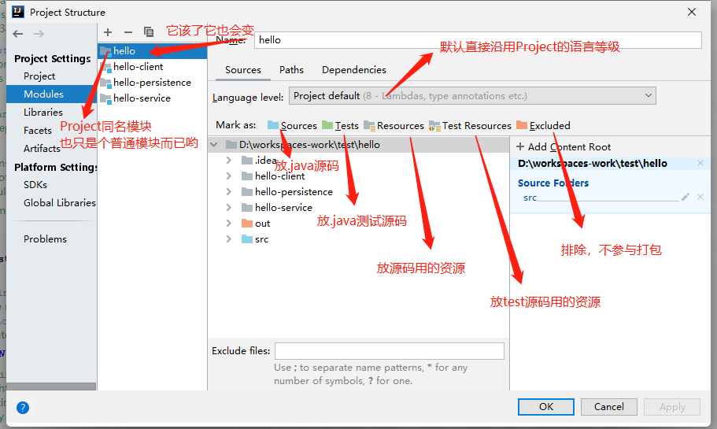

## 过程代码编写
```
alt+左右方向键        	切换
ctrl+tab        	    切换
ctrl+d 					复制一行
ctrl+y 				    删除一行
ctrl+alt+L  			格式化代码(代码可视性)，也支持选中项目后快捷操作
ctrl+r  				替换
ctrl+e  				查看哪些类已改变
ctrl+w  				选择鼠标所在的范围
ctrl+alt+v   			返回new的对象[待验证可行性]
ctrl+alt+M  			将方法里的代码行抽取出来形成新的方法
ctrl+alt+o   			去除没用的依赖包---[待验证可行性]
alt+1					切换到项目,再点就隐藏左侧项目栏
alt+7					当前类下面的方法名展示
ctrl+-    				折叠当前光标所在代码块
ctrl++   				展开当前光标所在代码块
ctrl+shift+enter		语句补全，补全大括号或者分号，跳出当前行
ctrl+shift+n            查找文件
ctrl+alt+方向键			跳转到上次鼠标所在位置

```

## 代码运行&调试
```
shift+F10   			run运行代码
shift+F6				选中包名或者类名以及变量名可以快速修改
ctrl+shift+F10          run运行当前鼠标类的main方法
shift+F9    			debug开始调试/重新调试代码
ctrl+shift+F9           debug运行，当前鼠标类的main方法
ctrl+F8					打断点
F8 (Step Over)			单步执行，不进入方法内部，适合逐行查看逻辑。
F7 (Step Into)			步入方法，进入当前行调用的方法内部，适合追踪自定义函数。
Shift+F8 (Step Out)		步出方法，快速执行完当前方法剩余代码并返回调用处。
F9 (Resume)				恢复执行，程序会继续运行直到遇到下一个断点。
ctrl+shift+F8			breakpoint,展示所有断点，以及关闭删除断点
```


## 对象&类&方法定位【部分需实操确认】
```
alt+insert   			相当于New In This Directory(file下的new),需要选中外层的包，点击类里面的时候是创建构造方法或者getset，tostring等generate
ctrl+alt+insert   		相当于New In This Directory(file下的new)，不需要选中外层的包
ctrl + h				查看类或接口的继承关系
ctrl+alt+b				查看其子类对象，查看当前接口实现类（包括间接实现或继承的子类）按ctrl+alt+b或者+鼠标左键---[待验证可行性]
ctrl+O   				选择性的覆盖重写
ctrl+i   				必须覆盖重写的方法
ctrl+p                  在需要放实参的括号中查看需要放入的参数信息
Ctrl + Alt + b			直接跳到接口的实现类（查接口实现非常方便）
ctrl+u  				切换到父类
ctrl+g  				切换到类的某一行
ctrl+b					打开选中的类
ctrl+F4					关闭当前类
ctrl+n                  查找classes，查看源码类
ctrl+F12				查看当前类的所有方法(包含父类)，输入内容即可搜索
shift+F6				快速改方法
```

## 快速代码语句生成
```
pv                      快速创建自定义方法和信息
psvm					快速创建main方法
souf					快速生成输出语句
psf                     快速生成静态成员，会生成静态常量
for循环的快速调用
  - iter：生成增强型 for 循环（即 for-each），适用于数组或集合遍历。
  - itar：生成基于索引的数组 for 循环（for (int i=0; i<arr.length; i++)）。
  - fori：生成普通 for 循环（需手动补全条件）。
  - itco：生成 Iterator 迭代器循环
  - 其他： 已知String[] strs；如果需要遍历这个字符串数据中的字符串，可以通过strs.for做批量遍历
    ~~~
    生成结果为：
       for (String str : strs) {...}
```

## 控制台遍历查看文件信息
```
alt+b   				build栏打开
alt+f   				file栏打开，以此类推
alt+enter  				万能提示
alt+F4					退出intellij
alt+F8					运行时代码执行器
alt+F12					打开本地terminal或者服务器terminal,或者选中文件右击打开terminal
选中类,按alt+方向键   	隐藏其他类及包只显示打开的类及对应的包，或者隐全部包括整个项目
alt+5					进入Debug控制台
alt+3					进入find控制台
alt+1					展示项目目录或隐藏
ctrl+shift+F12			当前窗口最大化
```

## 快速了解继承关系的方法
### 方法1、idea查看继承树或图标：
ctrl+h【右侧见Type Hierarchy】 https://cloud.tencent.com/developer/article/2487474
### 方法2、图形方式生成UML继承关系图【暂未实践】
Ctrl + Alt + U：在标签页内生成当前类的 UML 继承关系图，蓝色实线箭头是继承，绿色虚线箭头是接口实现

## 过程问题
- 现象：无法创建java的package包目录，如何解决
  1. 右键点击想要存放 package 的文件夹（通常是 src，当前环境是java），选择 Mark Directory as -> Sources Root源码根目录才会触发创建入口
  2. 需注意.java文件存储在package中
  3. 原因：Sources Root()
- 现象：资源文件下创建suties和子目录smoke时，展示结果一直是：suites.smoke
   1. 双击shift后，调用action，取消勾选：**Compact Middle Packages（中文叫：压缩中间包 / 隐藏空中间目录）**

## maven的pom.xml操作
1. 管理依赖程序
```
Alt + Insert        选择 Dependency‌，打开 Maven Artifact 搜索框，自定义传入依赖程序
```
2. 依赖文件下的作用域仅在test下生效
```html
`scope=test` 的含义：**只在 src/test/java 目录下可见**
<scope>test</scope>

```


## 注释模板操作[遵循JavaDoc标准标签列表]
1. 类头部注释模板（新建类自动出来 @author、@date）,`File → Settings(Ctrl+Alt+S) → Editor → File and Code Templates - File -Class`
  ```
  #if (${PACKAGE_NAME} && ${PACKAGE_NAME} != "")package ${PACKAGE_NAME};
  
  #end
  #parse("File Header.java")
  /**
  * TODO：功能描述
  *@author Anita
  *@version 1.0
  *@since ${YEAR}-${MONTH}-${DAY}  ${HOUR}:${MINUTE}
  *@BelongsProject ${PROJECT_NAME}
  *@BelongsPackage ${PACKAGE_NAME}
  */
  public class ${NAME} {
  }
  ```
2. 方法注释模板
   1. `Settings → Editor → Live Templates`
   2. 点`+` → Template Group，新建分组，名字：`myJavaDoc`
   3. 选中刚建好的分组，再次点`+` → Live Template，缩写写：`**`,描述写：`方法注释`
   4. Template text 粘贴下面完整模板：
   ```
     **
     * TODO:方法功能描述
     * @author Anita
     * @since $date$ $time$ $param$ $return$
       **/

    ```
   5. 点击`Edit variables`编辑变量
   - `date`：表达式填：date()
   - `time`：表达式填：time()
   - `PARAMS` 表达式填：`groovyScript("def result = '';def params = \"${_1}\".replaceAll('[\\\\[|\\\\]|\\\\s]', '').split(',').toList(); for(i = 0; i < params.size(); i++) {if(params[i] != '')result+='* @param ' + params[i] + ((i < params.size() - 1) ? '\\r\\n ' : '')}; return result == '' ? null : '\\r\\n ' + result", methodParameters())`
   - `RETURN_TYPE`：`groovyScript("return \"${_1}\" == 'void' ? null : '\\r\\n * @return ' + \"${_1}\"", methodReturnType())`
   6. 下方**Define**勾选：`Java`，代表只在 Java 方法声明处生效
   7. 使用方式：在方法上面输入 `/**` ，按下`Enter键`，自动解析当前方法所有入参，生成信息
   8. 参考示例：https://blog.csdn.net/blsc886/article/details/149095326

## idea编译和maven编译
1. idea下的project和module
```
project类似代码目录父模块，代表项目名
module模块是代码的具体表现形式，有些大型项目使用多模块编程
```
2. 关于Project Structure (ctrl+shift+alt+S)
- Project Settings：项目设置（最重要）
  > https://developer.cloud.tencent.com/article/1952865 
  - Project: 设置对所有module模块生效
  - Modules：一个项目下可以有多个模块，默认直接沿用projects下的配置；本模块的依赖情况默认存储在项目的{moduleName}.iml文件里
  
  - Libraries:当某Library是所有/大部分模块都需要的依赖时，就可以上升为Project级别的依赖，抽取到Libraries标签页来统一管理。
  - Facets:配置Project项目的框架区，它能看到项目的每个Module模块使用的框架、语言等情况，并且还可以对它们进行配置。
  - Artifacts：打包jar、war包
- Platform Settings：平台设置，也叫全局设置。用于管理SDK们（如JDK、Kotlin的SDK等）、全局库，用于SDK的版本切换。
3. 关于 SDK 和 JDK
- SDK 是“软件开发工具包”的总称，任何辅助开发某类软件的文档、工具、库的集合都可以叫 SDK；JDK 是专为 Java 语言开发的工具包，是 SDK 的一个子集。
- IntelliJ IDEA是JVM平台IDEA，不仅仅支持Java还有其它语言如Kotlin，所以写成SDK更抽象 

### maven构建和idea原生build
1. maven常用命令
- 执行 `mvn compile`：会**顺序执行defautlt周期中的所有阶段**，Maven 编译是调用 **maven-compiler-plugin** 插件，底层调用 javac。
   负责三件大事：
  1. 读取 `pom.xml` 解析依赖，去仓库下载（settings.xml 控制仓库、镜像、代理）、确认获取依赖无误
  2. 执行插件：编译、单元测试、打包
  3. 产物输出到 `target`
- 执行 `mvn clean`删除项目构建生成的 target 目录，让下次构建从干净状态开始‌
- 常用执行 `mvn clean verify` 是一条 Maven 构建命令，完整执行“清理 → 编译 → 测试 → 打包 → 验证”的流程，适合在本地或 CI 中做发布前的最终检查
2. idea的build项目
- 由IDEA 自己编译源码，不调用 Maven
   1. 产物默认在 `out` 目录
   2. 增量编译：只编译改动过的文件，速度很快
   3. **不会执行 Maven 插件！** 不会执行 pom 里配置的 generate 代码、资源过滤、打包逻辑
3. IDEA 和 Maven 怎么联动？
- IDEA 内置了 Maven 支持：**导入 pom.xml，把 Maven 的项目结构、依赖同步到 IDE 的工程模型**
- IDEA 读取 pom，解析依赖，展示 External Libraries
- 但**编译有两个选择**：用 IDEA 自带编译器 OR 委托给 Maven
> 【关键配置】`Settings → Build, Execution, Deployment → Build Tools → Maven → Runner`
✅ `Delegate IDE build/run actions to Maven`
勾选：IDEA 的 build/run 会**交给 Maven 执行**（相当于自动调用 mvn compile）
不勾选：IDEA 用自己编译器编译（默认）
4. idea和maven的重点配置清单
- 打开：File → Settings → Build, Execution, Deployment → Build Tools → Maven
  1. Maven home path：使用本地安装的maven版本
  2. User settings file：指定 settings.xml，可勾选 override 覆盖默认路径
  3. Local repository：本地仓库地址（由 settings.xml 定义），从指定的Nexus依赖仓库中获取合法依赖
  4. Runner → `Delegate IDE build/run actions to Maven`
    > 生产项目建议**勾选**，保证 IDE 打包和服务器 mvn 打包行为一致；代价是编译速度变慢，每次 build 都会走 maven。
  5. Importing 导入选项：自动导入 pom 变更（建议勾选）、Maven 导入使用的 JDK，**和项目 SDK 保持一致**
  6. 项目 SDK & Language level，应和IDEA Project Structure 里的 Language level 对齐，否则版本冲突
5. 实操决策思路
   1. **日常写代码，快速看语法报错**：不开启委托，用 IDEA 原生 Build（Ctrl+F9）速度快。
   2. **用到 pom 插件生成代码、资源过滤**：必须执行 Maven 命令（Maven 面板 compile/package），或者开启委托 Maven。
   3. **打包测试、准备部署，验证和线上 CI 一致**：一定要执行 `mvn package` / `mvn install`。

## 附录：
2026.2 版本编辑器右键上下文里，已经没有 Diagrams 选项可以勾选，只能用项目树右键或者快捷键。


